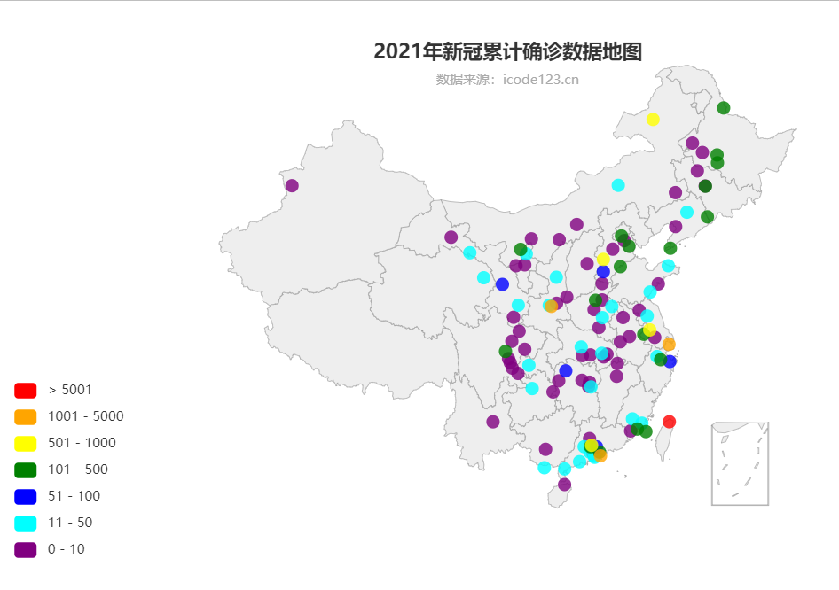

# 疫情数据可视化

## 项目目标

编写程序读取`Data.zip`中所包含的2021年新馆肺炎新增确诊数据，生成可视化疫情地图程序。

## 项目结构

```shell
.
├── Data.zip  # 2021年疫情数据
├── README.md
├── charts  # 功能模块目录
│   ├── __init__.py
│   ├── charts.py  # 生成数据分析地图
│   └── prepare.py  # 解压Data.zip，生成能被pyecharts识别的数据表
├── img
│   └── map.png  # 效果截图
├── main.py  # 主程序
└── web
    └── geo.html  # 渲染得到的地图页面

4 directories, 11 files
```

### 整理数据

将`Data.zip`解压后，分别读取其中的每个`.csv`文件，将相同城市的新增数据累加，最后得到能被`pyecharts`识别的经过升序排序的二维列表，最终统计结果如下：

```shell
[['宿州', 1], ['南宁', 1], ['铜仁', 1], ['廊坊', 1], ['安阳', 1], ['许昌', 1], ['鄂州', 1], ['南昌', 1], ['九江', 1], ['鄂尔多斯', 1], ['中卫', 1], ['海东市', 1], ['青岛', 1], ['运城', 1], ['自贡', 1], ['泸州', 1], ['绵阳', 1], ['南充', 1], ['宜宾', 1], ['资阳', 1], ['伊犁哈萨克自治州', 1], ['合肥', 2], ['陇南', 2], ['海口', 2], ['保定', 2], ['齐齐哈尔', 2], ['大庆', 2], ['荆州', 2], ['天门', 2], ['湘潭', 2], ['湘西自治州', 2], ['吉林', 2], ['通辽', 2], ['漳州', 3], ['益阳', 3], ['常州', 3], ['宿迁', 3], ['呼和浩特', 3], ['渭南', 3], ['广元', 3], ['中山', 4], ['驻马店', 4], ['松原', 4], ['晋中', 4], ['嘉峪关市', 5], ['黄冈', 5], ['长沙', 5], ['昆明', 5], ['开封', 7], ['六安', 8], ['清远', 9], ['营口', 10], ['吴忠', 10], ['珠海', 11], ['湛江', 11], ['西宁', 11], ['烟台', 11], ['延安', 11], ['阳江', 12], ['遵义', 12], ['淮安', 12], ['咸阳', 13], ['日照', 14], ['张掖', 15], ['江门', 15], ['商丘', 16], ['防城港', 20], ['周口', 20], ['锡林郭勒盟', 20], ['上饶', 21], ['重庆', 21], ['泉州', 24], ['肇庆', 27], ['株洲', 30], ['沈阳', 30], ['杭州', 32], ['澳门', 33], ['银川', 36], ['天水', 39], ['武汉', 40], ['荆门', 43], ['东莞', 60], ['张家界', 72], ['邢台', 73], ['宁波', 74], ['兰州', 83], ['长春', 105], ['深圳', 129], ['佛山', 154], ['阿拉善盟', 165], ['郑州', 192], ['莆田', 205], ['北京', 225], ['南京', 238], ['厦门', 241], ['黑河', 278], ['哈尔滨', 282], ['天津', 283], ['德宏州', 289], ['通化', 307], ['大连', 321], ['绍兴', 387], ['成都', 459], ['绥化', 490], ['呼伦贝尔', 559], ['扬州', 570], ['石家庄', 934], ['广州', 982], ['西安', 1466], ['上海', 1591], ['香港', 3845], ['台湾', 16233]
]
```

> 注：
>
> - 在得到统计结构后，解压的`Data`目录会被删去；
> - 为了增强地图易读性，本程序将疫情新增为$0$的城市删去

### 渲染地图

本项目使用`pyecharts`中的`geo`绘制国家省级地图，将数据列表分成`7`部分，并用不同颜色标记，详细如下：

```python
{'min': 1, 'max': 10, 'label': "1 - 10", 'color': 'purple'},
{'min': 11, 'max': 50, 'label': "11 - 50", 'color': 'cyan'},
{'min': 51, 'max': 100, 'label': "51 - 100", 'color': 'blue'},
{'min': 101, 'max': 500, 'label': "101 - 500", 'color': 'green'},
{'min': 501, 'max': 1000, 'label': "501 - 1000", 'color': 'yellow'},
{'min': 1001, 'max': 5000, 'label': "1001 - 5000", 'color': 'orange'},
{'min': 5001, 'label': "> 5001", 'color': 'red'}
```

## 项目效果



